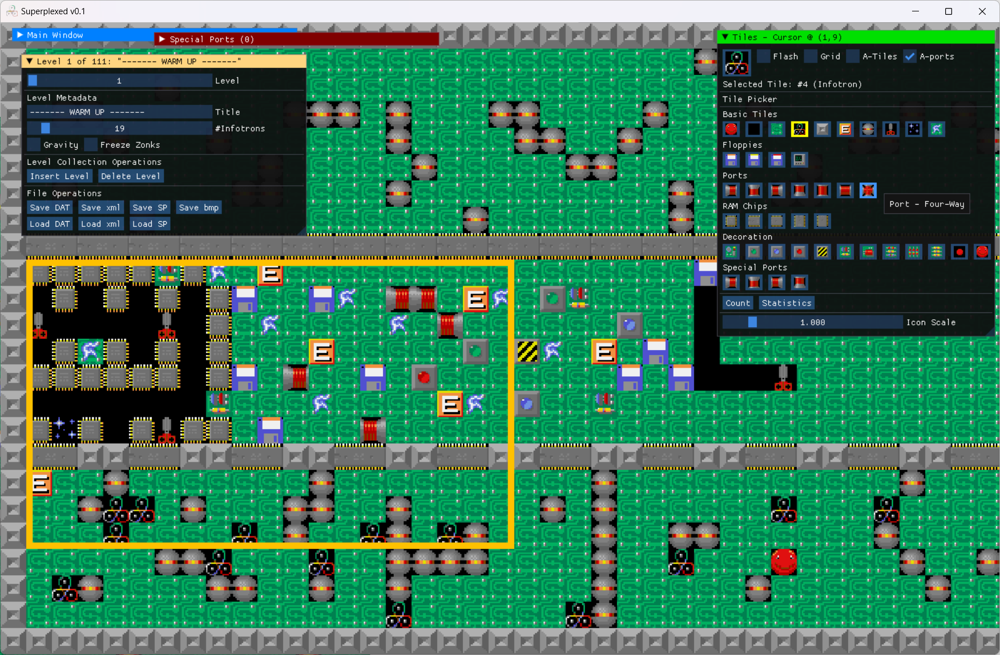
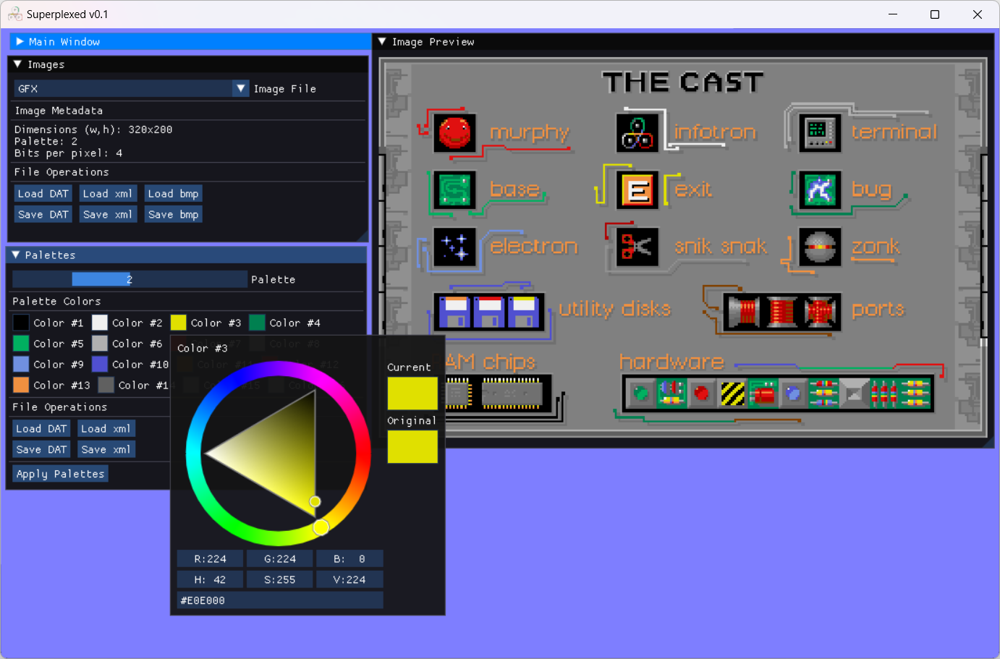

# Superplexed - An all-round editor for Supaplex

Welcome to the Superplexed code repository and release page. The current version of the editor is 0.11. The code is standard C++20, and the project files were created using Microsoft Visual Studio Community 2022. You can compile the application from source, or get the latest precompiled win-x64 distribution under the [repository releases](https://github.com/kaimitai/superplexed/releases/). \
Make sure to read the included documentation (readme.html in the docs folder) for a detailed overview.
  
### Editor Capabilities
The editor allows you to alter all Supaplex datafiles; levels, graphics and savefiles. A more detailed overview follows:
  
### Level Editing
The main part of the editor is of course level editing. The "Levels" window presents all the levels in a levelset-file in a graphical way, and lets you edit a level's metadata and its tilemap. The board grid features copy/paste capabilities, undo/redo with history, operations to flip or rotate a selection (which will also flip/rotate pipe tiles and RAM chip tiles accordingly), as well as supporting painting and color fills. The editor can be completely mouse-driven, but supports keyboard shortcuts for almost all operations. The board tiles can be animated, and gridlines can be enabled.
  
We can save the boards to levelsets (DAT) and individual levels (SP). These formats are supported by the DOS version of the game, as well as the excellent port [Supaplex Online](https://supaplex.online/), where you can upload and share your creations. We can export the levels as bmp images, and we also support our own XML format - which allows users to more easily compare file versions, use version control systems to track file history, and collaborate on level pack projects.

###### The editor will show all the level and tile information
  
### Graphics viewer, exporter and importer
In the Graphics windows, all graphics files - including fonts - can be viewed and edited. The bitmaps themselves can be exported to - and imported from - BMP files. We also support our own XML format for images.
  
In addition, we can edit the game's palettes using color pickers.
  

###### The graphics window shows the loaded graphics from GFX.DAT
  
### Savefile editor
A third window, Savefiles, will let you alter any aspect of the player database, including adding/removing players, changing level solved status for any level, and set the total playtime durations. The "Hall of Fame" can be altered in a similar way.
  

It is highly recommended to have a look at the documentation for efficient usage tips.

### Changes since v0.1

* Improved code portability, thanks to [skeeto](https://github.com/skeeto)
* Fixed an oversight in the level bmp creator, where the wrong tile would be used for the "bug" enemy in output images
